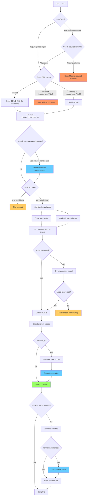

# fganalysis R Package

## Overview

The `fganalysis` is an R package designed for common analyses performed in FinnGen. It provides functions for data processing, summarization, and visualization of lab measurements and drug purchases to study drug response.

## Package Structure

The package is organized into logical modules for better maintainability:

### R/ Directory Structure

- **`connections.R`** - Database connection management
  - `connect_fgdata()` - Establishes connections to FinnGen data sources

- **`data_access.R`** - Data retrieval functions
  - `get_lab_measurements()` - Retrieves lab measurement data
  - `get_drug_purchases()` - Retrieves drug purchase data
  - `get_first_purchase()` - Gets first drug purchase for each individual

- **`drug_response_core.R`** - Core drug response analysis
  - `drug.response()` - Creates drug response S3 object
  - `create_drug_response()` - Main function for drug response analysis
  - `generate_response_summary()` - Summarizes drug responses

- **`visualization.R`** - Plotting and visualization functions
  - `summarize_drug_response()` - Creates comprehensive summary plots and tables
  - `plot_lab_value_distribution()` - Boxplot comparison of lab values
  - `summarize_drug_purchases_upset()` - UpSet plot for drug combinations

- **`blup_analysis.R`** - BLUP/Linear Mixed Model analysis
  - `calculate_blup_slopes()` - Calculates individual-specific slopes using LMM
  - `summarize_blup_results()` - Summarizes BLUP analysis results

- **`qc_functions.R`** - Quality control and normalization functions
  - `inverse_rank_normalize()` - Performs inverse rank normalization on numeric vectors
  - `calculate_fixed_slopes()` - Calculates fixed-effect slopes for comparison with BLUPs
  - `process_variance_files()` - Processes variance files with inverse rank normalization
  - `create_variance_summary_table()` - Creates summary statistics table
  - `generate_variance_plots()` - Generates comparison plots for variance distributions

This modular structure makes it easier to maintain, test, and extend the package functionality.

## Installation

To use this package, you can install it from a local source. First, ensure you have the `devtools` package installed in R.

```R
# If devtools is not installed, run this line:
# install.packages("devtools")

# Set MAKEFLAGS for faster compilation if installing from source
Sys.setenv(MAKEFLAGS = "-j4")

# Install the package from its local directory
devtools::install("path/to/fganalysis-r")
```

Once installed, load the package into your R session:

```R
library(fganalysis)
```

## Data Access

The package accesses data through a centralized connection object. The connection is configured via a JSON file, which specifies the paths to different datasets.

### Configuration

The `connect_fgdata()` function reads a JSON configuration file to set up data sources. A sample configuration file `config/db_config.json` looks like this:

```json
{
    "pheno": {
        "path": "/path/to/finngen_R13_service_sector_detailed_longitudinal_1.0.parquet",
        "type": "parquet-hive"
    },
    "labs": {
        "path": "/path/to/finngen_R13_kanta_lab_1.0.parquet",
        "type": "parquet"
    },
    "minimum": {
        "path": "/path/to/finngen_R13_minimum_extended_1.0.parquet",
        "type": "parquet"
    },
    "cov_pheno": {
        "path": "/path/to/R13_COV_PHENO_V0.parquet",
        "type": "parquet"
    }
}
```

The package uses `duckdb` to query data stored in the `parquet` format. The connection object returned by `connect_fgdata` contains lazy-loaded `dplyr` tables (`tbl` objects), meaning the data is only loaded into memory when you explicitly perform a query.

The main data tables are:
- **`pheno`**: Longitudinal data from service sector records, including drug purchases.
- **`labs`**: Laboratory measurements from KANTA.
- **`minimum`**: Minimum phenotype data for individuals.
- **`cov_pheno`**: Covariate phenotype data.
- **`endpoint`**: Endpoint data in long format.
- **`vnr`**: VNR (Väestörekisterikeskus) data.
- **`long_anthropometric`**: Longitudinal anthropometric measurements.

### Local Configuration

For local development, you can create a `config/db_config_local.json` file with paths specific to your environment. This file is automatically ignored by git, so you can customize it without affecting the repository. The package will look for this file first, and fall back to `config/db_config.json` if it doesn't exist.

Example local configuration:
```json
{
    "pheno": {
        "path": "/your/local/path/to/finngen_R13_service_sector_detailed_longitudinal_1.0.parquet",
        "type": "parquet-hive"
    },
    "labs": {
        "path": "/your/local/path/to/finngen_R13_kanta_lab_1.0.parquet",
        "type": "parquet"
    }
}
```

### Connecting to Data

To establish a connection, pass the path to your configuration file to `connect_fgdata`:

```R
# The path can be relative or absolute
# In the FinnGen Sandbox, a pre-configured file is available
conn <- connect_fgdata("/finngen/shared_nfs/finngen/code/drugResponsePackage/config/db_config_sb.json")

# Or using a local config file
conn <- connect_fgdata("config/db_config.json")

## Returned object has attributes that are lazy loaded data frames of different phenotype data.
## You can start writing dplyr queries and e.g. joining to other tables. Nothing will happen before you actually request the data to be localized.
## Behind the scenes, a query engine optimizes the query and returns only the data matching your query.

## Query for individuals with ICD-10 code K51 (IBD)
ibd <- conn$pheno %>%
  filter((SOURCE == "INPAT" | SOURCE == "OUTPAT") & CODE1 == "K51" & ICDVER == "10") %>%
  group_by(FINNGENID) %>%
  summarize(n_diagnoses = n())

## Look at the number of rows
nrow(ibd)
# NA - you get NA because nothing has been queried before you ask for the data.
# Use function collect to execute the query and return results
ibd <- ibd %>% collect()
nrow(ibd)
# 258

## Get all labs with omopid 3007461
labs <- get_lab_measurements(conn$labs, c("3007461"))

## Get all drug purchases with ATC codes starting with L01B
dr <- get_drug_purchases(conn$pheno, c("L01B"))

# Create drug response data of lab changes after initiating a drug.
## First define time intervals from drug purchase to summarise lab values
## Here defining pre-measurements drug measurements to be 1 year before drug and
## after period to be 1 month to 1 year.
before_period <- c(-1, 0)
after_period <- c(1/12, 1)

## Create a dataframe containing LDL (omopid 3001308) response to first statin purchase (ATC codes starting with A10) for each finngen ID
resp <- create_drug_response(conn, c("3001308"),
                             druglist = c("A10"),
                             before_period,
                             after_period,
                             remove_outliers_sd = 3)  # Optional: remove outliers

## Create plots and tables of the response
summarize_drug_response(resp, out_file_prefix = "3001308_A10_resp")
```

The returned `conn` object is a `fg_data_connection` object, and you can access the data tables as its attributes (e.g., `conn$pheno`, `conn$labs`).

## Available Functions

This package provides a suite of functions for drug response analysis.

### Data Connection
- **`connect_fgdata(path_to_conf)`**: Connects to the databases specified in the JSON configuration file and returns a `fg_data_connection` object.

### Data Retrieval
- **`get_lab_measurements(all_labs, lablist, require_values = TRUE, return_cols = c("FINNGENID","OMOP_CONCEPT_ID", "EVENT_AGE", "MEASUREMENT_VALUE_HARMONIZED"), finngen_ids = NULL, lazy = FALSE, covariates = NULL, covariate_cols = NULL)`**: Extracts lab measurements for specified OMOP concept IDs.
  - `require_values`: If TRUE, only returns rows with non-missing MEASUREMENT_VALUE_HARMONIZED
  - `return_cols`: Columns to return from the lab data
  - `finngen_ids`: Optional vector of FINNGENIDs to filter the data
  - `lazy`: If TRUE, returns a lazy tbl object instead of collecting data
  - **NEW**: Can now optionally join covariates (e.g., SEX, AGE_AT_DEATH_OR_END_OF_FOLLOWUP) from a separate table via `covariates` and `covariate_cols` parameters. Note: Covariate columns are added through a left join operation and don't need to exist in the lab data table
- **`get_drug_purchases(all_phenos, druglist, finngen_ids = NULL, return_cols = c("FINNGENID","EVENT_AGE", ATC="CODE1", REIMB_CODE="CODE2", VNR="CODE3", N_PACKS="CODE4"), lazy = FALSE)`**: Extracts drug purchases for specified ATC codes. The matching is done on the beginning of the ATC code.
- **`get_first_purchase(all_phenos, druglist, finngen_ids = NULL, return_cols = c("FINNGENID","EVENT_AGE","CODE1"), lazy = FALSE)`**: A wrapper around `get_drug_purchases` to get only the first purchase event for each individual.

### Analysis
- **`create_drug_response(conn, lablist, druglist, before_period, after_period, finngen_ids = NULL, remove_outliers_sd = NULL, covariates = NULL, covariate_cols = NULL)`**: The main analysis function. It calculates the drug response based on lab value changes before and after the first drug purchase. The `remove_outliers_sd` parameter can be used to remove outliers (specify number of SDs from mean, e.g., 1-6). It can now optionally join in subject-level covariates.
- **`generate_response_summary(lab_measurements, before_period, after_period, summary_function = median)`**: A helper function to calculate the summary statistics for the response (e.g., median value before and after treatment). Called by `create_drug_response`. The `summary_function` parameter allows using different summary statistics (default is median).
- **`get_measurements_before_drug(conn, lablist, druglist, months_before = 3, covariates = NULL, covariate_cols = NULL, remove_outliers_sd = NULL, winsorize_pct = NULL, range_sd_filter = NULL)`**: A standalone function to retrieve lab measurements, specifically designed for preparing data for BLUP analysis. It filters measurements to a specified window before a drug purchase for exposed individuals and includes all measurements for unexposed individuals.
  - `conn`: A `fg_data_connection` object.
  - `lablist`: A character vector of OMOP concept IDs for the labs of interest.
  - `druglist`: A character vector of ATC drug codes to define the "exposed" cohort.
  - `months_before`: The time window in months before the first drug purchase to include lab measurements (default is 3).
  - `covariates`: An optional data frame or lazy table containing covariate data (e.g., `conn$cov_pheno`).
  - `covariate_cols`: A character vector of column names to join from the `covariates` table (e.g., `c("SEX")`).
  - `remove_outliers_sd`: Optional parameter to remove outliers based on standard deviation (e.g., `remove_outliers_sd = 4`).
  - `winsorize_pct`: Optional parameter to cap extreme values using Winsorization. Values between 0 and 0.5 specify the percentage to winsorize on each tail (e.g., `winsorize_pct = 0.05` caps values below the 5th percentile and above the 95th percentile). This is a percentage to winsorise on each tail which is equivalent of (1- `winsorize_pct`) proportion to keep:
      - insorize_pct = 0.01 → Caps at 1st and 99th percentiles (1% on each tail)
      - winsorize_pct = 0.05 → Caps at 5th and 95th percentiles (5% on each tail)
      - winsorize_pct = 0.10 → Caps at 10th and 90th percentiles (10% on each tail)
  - `range_sd_filter`: An optional parameter for robust outlier removal. It takes a list with three named elements: `lower_bound`, `upper_bound`, and `nsd`. The function calculates the mean and standard deviation on the subset of data within the specified bounds and then removes all values from the original data that are more than `nsd` standard deviations from that calculated mean. This is useful for removing extreme outliers without them skewing the statistics used for the filtering itself. Example: `range_sd_filter = list(lower_bound = 50, upper_bound = 200, nsd = 4)`.
   Note: Only one outlier removal method (`remove_outliers_sd`, `winsorize_pct`, or `range_sd_filter`) should be used at a time.

- **`get_median_pre_drug(conn, lablist, druglist, months_before = 1, covariates = NULL, covariate_cols = NULL, remove_outliers_mad_th = 5, generate_plots = FALSE, output_dir = ".", output_file_prefix = "")`**: Calculates median lab values pre-medication with MAD-based outlier removal.
  - Outputs tab-delimited files (`{output_file_prefix}_{OMOP_CONCEPT_ID}_DF13_median.tsv`) with columns: FID, IID, and {OMOP_CONCEPT_ID}_median
  - Generates diagnostic plots when `generate_plots = TRUE`: histograms and sex-stratified violin plots
  - Uses Median Absolute Deviation (MAD) for robust outlier removal with threshold parameter

### Output File Naming Convention
To avoid file conflicts when running both BLUP and median analyses:
- **BLUP output files**: `{output_file_prefix}_{OMOP_CONCEPT_ID}_DF13_blup.tsv`
- **BLUP model files**: `{output_file_prefix}_{OMOP_CONCEPT_ID}_blup_model.rds`
- **BLUP description files**: `{output_file_prefix}_{OMOP_CONCEPT_ID}_DF13_blup_descriptionfile.tsv`
- **Median output files**: `{output_file_prefix}_{OMOP_CONCEPT_ID}_DF13_median.tsv`
- **Median description files**: `{output_file_prefix}_{OMOP_CONCEPT_ID}_DF13_median_descriptionfile.tsv`

### Summarization and Output
- **`summarize_drug_response(drug_response, out_file_prefix)`**: Generates a PDF report with plots and tables summarizing the drug response analysis.
- **`summarize_drug_purchases_upset(drug_response, out_file_prefix)`**: Generates a PDF file containing an UpSet plot to visualize the intersections of drug purchases.
- **`drug.response(...)`**: This is not a function to be called directly by the user, but rather the S3 object class that holds the results from `create_drug_response`. It's a list containing the response data, all lab measurements, all drug purchases, and the time periods used for the analysis.
- **`plot_lab_value_distribution(drug_response, remove_outliers = FALSE)`**: Creates and returns a `ggplot` object containing violin plots (with overlaid boxplots) that compare the distribution of lab values before and after the first drug purchase. The plot is faceted by drug type and includes statistical significance tests. **UPDATED**: Now uses violin plots with consistent ordering ("Before" always on the left in teal #00AFBB, "After" always on the right in gold #E7B800) and ggpubr styling.

### BLUP Analysis (Linear Mixed Models)
- **`calculate_blup_slopes(data, output_dir = ".", min_measurements = 2, include_sex = TRUE, debug_dir = NULL, drug_exposed_only = FALSE, calculate_post_variance = FALSE, calculate_qc = FALSE, normalize_variance = FALSE, save_model = FALSE, plot_blup_correlation = FALSE, output_file_prefix = NULL, smooth_measurement_intervals = NULL)`**: Implements a linear mixed model (LMM) to calculate Best Linear Unbiased Predictors (BLUPs) for individual-specific slopes of lab value changes over age. This follows the methodology from [Wiegrebe et al. (2024) Nature Communications](https://www.nature.com/articles/s41467-024-54483-9). The function:
  - **NEW**: Accepts either a `drug.response` object OR a data frame with lab measurements (must contain: FINNGENID, OMOP_CONCEPT_ID, EVENT_AGE, MEASUREMENT_VALUE_HARMONIZED)
  - Fits a model: `lab_value ~ sex + age + (age | FINNGENID)` with random intercepts and slopes
  - Sex is coded according to the PLINK/REGENIE standard (1=Male, 2=Female, 0=Missing/Unknown)
  - If `include_sex = TRUE` (default), the function expects a SEX column in the drug_response object. If not found, it will raise an error with instructions to use `create_drug_response()` with appropriate covariates
  - If `include_sex = FALSE`, all subjects are coded as male (1) and sex is not included in the model
  - Includes robust convergence handling: scales age for numerical stability and falls back to simpler models if needed
  - Outputs tab-delimited files (`{OMOP_CONCEPT_ID}_DF13_blup.tsv`) with columns: FID, IID, and {OMOP_CONCEPT_ID}_slope
  - **NEW: Quality Control Features**:
    - When `calculate_qc = TRUE`: Calculates fixed-effect slopes for comparison with BLUPs and reports correlation
    - When `normalize_variance = TRUE`: Adds quantile-normalized variance column to variance output files
    - QC correlation helps validate that random effects are capturing individual variation appropriately
  - **NEW: Model Saving and Visualization**:
    - When `save_model = TRUE`: Saves the fitted lmer model object as an RDS file (`{OMOP_CONCEPT_ID}_model.rds`)
    - When `plot_blup_correlation = TRUE`: Creates a scatter plot comparing BLUP slopes with fixed-effect slopes, including correlation coefficient, p-value, and regression line with confidence interval (requires `ggpubr` package)
    - Plot uses `theme_bw()` and is saved as `{OMOP_CONCEPT_ID}_blup_correlation.pdf`
  - **NEW: Interval Smoothing**:
    - The `smooth_measurement_intervals` parameter accepts a numeric value (1-12) to smooth clustered measurements that are less than the specified number of months apart by replacing them with a single representative measurement (mean age, median value). This can produce more stable estimates of long-term trajectories.
  - Returns a list with model details and BLUP estimates for each lab measurement type

#### Scaling and Back-transformation Note
To improve model convergence, the function standardizes both age and lab values:
- **Scaling**: Both variables are centered (mean-subtracted) and divided by their standard deviations
  - `age_scaled = (age - mean(age)) / sd(age)`
  - `lab_scaled = (lab - mean(lab)) / sd(lab)`
- **Model fitting**: The LMM is fitted on scaled data, producing slopes in units of SD(lab)/SD(age)
- **Back-transformation**: Slopes are converted to original units (lab value change per year):
  - `original_slope = scaled_slope × (sd(lab) / sd(age))`
- This approach maintains numerical stability while preserving interpretability

#### BLUP Analysis Workflow



- **`summarize_blup_results(blup_results)`**: Provides summary statistics (mean, SD, min, max) for the BLUP slopes from each OMOP concept.

### Quality Control and Normalization Functions
- **`inverse_rank_normalize(x)`**: Performs inverse rank normalization on a numeric vector, transforming it to follow a standard normal distribution while preserving rank order.
- **`calculate_fixed_slopes(data, min_measurements = 2)`**: Calculates individual-specific slopes using simple linear regression (fixed effects only) for comparison with BLUP estimates.
- **`process_variance_files(output_dir = ".", generate_plots = FALSE, save_normalized = TRUE)`**:
  - Reads all `*_variance.tsv` files in the specified directory
  - Adds inverse rank normalized variance columns
  - Generates summary statistics for both original and normalized values
  - Optionally creates comparison plots showing distributions before/after normalization
  - Saves files with `_qnorm.tsv` suffix containing the normalized data

## Example Workflow

Here is a complete example of how to use the package to analyze the effect of statins (ATC code `A10`) on LDL cholesterol levels (OMOP ID `3001308`).

```R
# 1. Load the package
library(fganalysis)

# 2. Connect to the data sources
#    (replace with the correct path to your config file)
conn <- connect_fgdata("config/db_config.json")

# The conn object contains lazy-loaded tables.
# You can use dplyr verbs on them. The query is executed only when you `collect()`.
# For example, count IBD diagnoses:
ibd_counts <- conn$pheno %>%
  filter((SOURCE == "INPAT" | SOURCE == "OUTPAT") & CODE1 == "K51" & ICDVER == "10") %>%
  group_by(FINNGENID) %>%
  summarise(n_diagnoses = n()) %>%
  collect()

print(head(ibd_counts))


# 3. Define parameters for drug response analysis
#    - Lab ID for LDL
#    - ATC code for statins
#    - Time windows for "before" and "after" measurements
lab_id <- c("3001308")
drug_codes <- c("A10")
before_window <- c(-1, 0)      # 1 year before to drug purchase
after_window <- c(1/12, 1)   # 1 month to 1 year after drug purchase

# 4. Run the drug response analysis
#    This function will:
#    - Get the relevant lab measurements and drug purchases.
#    - Find the first drug purchase for each individual.
#    - Calculate the difference in median lab values between the 'after' and 'before' periods.
#    - Optionally, join in specified covariates.
response_data <- create_drug_response(
  conn = conn,
  lablist = lab_id,
  druglist = drug_codes,
  before_period = before_window,
  after_period = after_window
  # Optionally remove outliers: remove_outliers_sd = 3
  # Optionally add covariates:
  # covariates = conn$cov_pheno,
  # covariate_cols = c("SEX", "AGE_AT_DEATH_OR_END_OF_FOLLOWUP")
)

# 5. Summarize the results
#    This will create a PDF file with plots and text files with summary tables.
summarize_drug_response(response_data, out_file_prefix = "statin_ldl_response_summary")

# 6. (Optional) Generate an UpSet plot of drug purchase combinations
#    This visualizes which drug combinations are most common among the cohort.
summarize_drug_purchases_upset(response_data, out_file_prefix = "statin_purchase_combinations")

# 7. (Optional) Create a boxplot of lab value distributions
#    This function returns a ggplot object that can be printed or saved.
lab_distribution_plot <- plot_lab_value_distribution(response_data, remove_outliers = TRUE)

# Print the plot to the active graphics device
print(lab_distribution_plot)

# Or save it to a file
ggsave("statin_ldl_distribution.pdf", plot = lab_distribution_plot, width = 10, height = 8)

# 8. (Optional) Calculate BLUP slopes for longitudinal trajectories
#    This estimates individual-specific rates of lab value change over age
#    Note: SEX data must be included in the drug_response object via create_drug_response()
blup_results <- calculate_blup_slopes(response_data,
                                      output_dir = "blup_output",
                                      calculate_qc = TRUE,  # NEW: Calculate QC metrics
                                      normalize_variance = TRUE,  # NEW: Add qnorm to variance files
                                      save_model = TRUE,  # NEW: Save fitted lmer models
                                      plot_blup_correlation = TRUE)  # NEW: Create BLUP vs OLS correlation plots

# Summarize the BLUP results
blup_summary <- summarize_blup_results(blup_results)
print(blup_summary)

# NEW: Access saved models and correlation information
for (concept_id in names(blup_results)) {
  result <- blup_results[[concept_id]]

  # Check if model was saved
  if (!is.null(result$model_file)) {
    cat("Model saved to:", result$model_file, "\n")
    # Load the model if needed
    # saved_model <- readRDS(result$model_file)
  }

  # Check if correlation plot was created
  if (!is.null(result$plot_file)) {
    cat("Correlation plot saved to:", result$plot_file, "\n")
  }

  # Access correlation statistics
  if (!is.null(result$blup_fixed_correlation)) {
    cat("BLUP-OLS correlation for", concept_id, ":\n")
    cat("  r =", round(result$blup_fixed_correlation$correlation, 3), "\n")
    cat("  p =", format.pval(result$blup_fixed_correlation$p_value), "\n")
    cat("  n =", result$blup_fixed_correlation$n_pairs, "pairs\n")
  }
}

# 8b. Calculate BLUP slopes directly from lab measurements
#     This allows BLUP analysis without drug response analysis
# Option 1: Pull lab measurements with covariates using the new functionality
lab_measurements <- get_lab_measurements(conn$labs,
                                         lablist = c("3001308", "3027114"),  # LDL and HDL
                                         require_values = TRUE,
                                         covariates = conn$cov_pheno,
                                         covariate_cols = c("SEX", "AGE_AT_DEATH_OR_END_OF_FOLLOWUP"))

# Calculate BLUPs directly with SEX included and new features
blup_results_direct <- calculate_blup_slopes(lab_measurements,
                                             output_dir = "blup_output_direct",
                                             include_sex = TRUE,
                                             calculate_qc = TRUE,
                                             save_model = TRUE,
                                             plot_blup_correlation = TRUE)

# Option 2: If you don't need covariates, you can skip them
lab_measurements_no_cov <- get_lab_measurements(conn$labs,
                                                 lablist = c("3001308", "3027114"),
                                                 require_values = TRUE)

# Calculate BLUPs without sex adjustment
blup_results_no_sex <- calculate_blup_slopes(lab_measurements_no_cov,
                                              output_dir = "blup_output_direct",
                                              include_sex = FALSE,  # Must be FALSE without SEX column
                                              calculate_qc = TRUE)

# 8c. Get measurements before drug purchase for BLUP analysis
# This standalone function is the recommended way to prepare data for BLUP analysis,
# as it handles filtering before a drug purchase and outlier removal in a single step.

# Example 1: Using standard deviation for outlier removal
measurements_for_blup_sd <- get_measurements_before_drug(
  conn = conn,
  lablist = c("3001308"), # LDL
  druglist = c("C10AA"),  # Statins
  months_before = 3,     # 3 month window before first purchase
  covariates = conn$cov_pheno,
  covariate_cols = c("SEX"),
  remove_outliers_sd = 4  # Remove values > 4 SD from the mean
)

# Example 2: Using Winsorizing for outlier removal
measurements_before_drug_purchase <- get_measurements_before_drug(
  conn = conn,
  lablist = c("3001308"),
  druglist = c("C10AA"),
  months_before = 3,
  covariates = conn$cov_pheno,
  covariate_cols = c("SEX"),
  winsorize_pct = 0.05 # Cap values at the 5th and 95th percentiles
)

# NEW Example 3: Using range-based SD filter for robust outlier removal
measurements_for_blup_ranged <- get_measurements_before_drug(
  conn = conn,
  lablist = c("3001308"),
  druglist = c("C10AA"),
  months_before = 3,
  covariates = conn$cov_pheno,
  covariate_cols = c("SEX"),
  range_sd_filter = list(lower_bound = 1, upper_bound = 8, nsd = 4)
)

# The resulting dataframe can be passed directly to calculate_blup_slopes()
# blup_results <- calculate_blup_slopes(
#   data = measurements_for_blup_sd,
#   output_dir = "blup_output"
# )

# 8d. (NEW) Example of using interval smoothing for BLUP calculation
blup_results_smoothed <- calculate_blup_slopes(
  data = measurements_for_blup_sd,
  output_dir = "blup_output_smoothed",
  smooth_measurement_intervals = 6 # Activate smoothing for measurements < 6 months apart
)

# 9. (Optional) Process variance files with inverse rank normalization
#    This creates summary statistics and comparison plots
variance_summary <- process_variance_files(output_dir = "blup_output",
                                           generate_plots = TRUE,
                                           save_normalized = TRUE)
print(variance_summary)
```

This will produce files like `statin_ldl_response_summary.pdf`, `statin_ldl_response_summary_responses_by_drug.txt`, etc., in your working directory.

## Recent Updates

### Bug Fixes
- **Fixed `get_lab_measurements` covariate handling**: The function now correctly handles covariate columns by only selecting them from the appropriate table after joining. Previously, the function would error if covariate columns didn't exist in the lab data table.

## Development

Contributions and improvements are welcome.

### Running Tests

The package uses `testthat` for unit tests. To run the tests, use:

```R
devtools::test()
```

When adding new functionality, please add corresponding unit tests in the `tests/testthat/` directory.

## Authors

- **Mitja Kurki, PhD** (Author, Creator) - <mkurki@broadinstitute.org>
- **Reza Jaba, PhD** (Contributor) - <rjabal@broadinstitute.org>

## License

This package is licensed under the MIT License.
