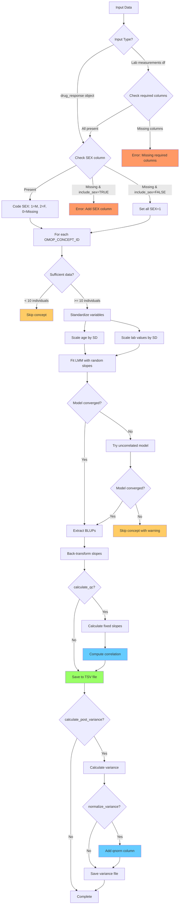

# fganalysis R Package

## Overview

The `fganalysis` is an R package designed for common analyses performed in FinnGen. It provides functions for data processing, summarization, and visualization of lab measurements and drug purchases to study drug response.

## Package Structure

The package is organized into logical modules for better maintainability:

### R/ Directory Structure

- **`connections.R`** - Database connection management
  - `connect_fgdata()` - Establishes connections to FinnGen data sources

- **`data_access.R`** - Data retrieval functions
  - `get_lab_measurements()` - Retrieves lab measurement data
  - `get_drug_purchases()` - Retrieves drug purchase data
  - `get_first_purchase()` - Gets first drug purchase for each individual

- **`drug_response_core.R`** - Core drug response analysis
  - `drug.response()` - Creates drug response S3 object
  - `create_drug_response()` - Main function for drug response analysis
  - `generate_response_summary()` - Summarizes drug responses

- **`visualization.R`** - Plotting and visualization functions
  - `summarize_drug_response()` - Creates comprehensive summary plots and tables
  - `plot_lab_value_distribution()` - Boxplot comparison of lab values
  - `summarize_drug_purchases_upset()` - UpSet plot for drug combinations

- **`blup_analysis.R`** - BLUP/Linear Mixed Model analysis
  - `calculate_blup_slopes()` - Calculates individual-specific slopes using LMM
  - `summarize_blup_results()` - Summarizes BLUP analysis results

- **`qc_functions.R`** - Quality control and normalization functions
  - `quantile_normalize()` - Performs quantile normalization on numeric vectors
  - `calculate_fixed_slopes()` - Calculates fixed-effect slopes for comparison with BLUPs
  - `process_variance_files()` - Processes variance files with quantile normalization
  - `create_variance_summary_table()` - Creates summary statistics table
  - `generate_variance_plots()` - Generates comparison plots for variance distributions

This modular structure makes it easier to maintain, test, and extend the package functionality.

## Installation

To use this package, you can install it from a local source. First, ensure you have the `devtools` package installed in R.

```R
# If devtools is not installed, run this line:
# install.packages("devtools")

# Set MAKEFLAGS for faster compilation if installing from source
Sys.setenv(MAKEFLAGS = "-j4")

# Install the package from its local directory
devtools::install("path/to/fganalysis-r")
```

Once installed, load the package into your R session:

```R
library(fganalysis)
```

## Data Access

The package accesses data through a centralized connection object. The connection is configured via a JSON file, which specifies the paths to different datasets.

### Configuration

The `connect_fgdata()` function reads a JSON configuration file to set up data sources. A sample configuration file `config/db_config.json` looks like this:

```json
{
    "pheno": {
        "path": "/path/to/finngen_R13_service_sector_detailed_longitudinal_1.0.parquet",
        "type": "parquet-hive"
    },
    "labs": {
        "path": "/path/to/finngen_R13_kanta_lab_1.0.parquet",
        "type": "parquet"
    },
    "minimum": {
        "path": "/path/to/finngen_R13_minimum_extended_1.0.parquet",
        "type": "parquet"
    },
    "cov_pheno": {
        "path": "/path/to/R13_COV_PHENO_V0.parquet",
        "type": "parquet"
    }
}
```

The package uses `duckdb` to query data stored in the `parquet` format. The connection object returned by `connect_fgdata` contains lazy-loaded `dplyr` tables (`tbl` objects), meaning the data is only loaded into memory when you explicitly perform a query.

The main data tables are:
- **`pheno`**: Longitudinal data from service sector records, including drug purchases.
- **`labs`**: Laboratory measurements from KANTA.
- **`minimum`**: Minimum phenotype data for individuals.
- **`cov_pheno`**: Covariate phenotype data.

### Connecting to Data

To establish a connection, pass the path to your configuration file to `connect_fgdata`:

```R
# The path can be relative or absolute
# In the FinnGen Sandbox, a pre-configured file is available
conn <- connect_fgdata("/finngen/shared_nfs/finngen/code/drugResponsePackage/config/db_config_sb.json")

# Or using a local config file
conn <- connect_fgdata("config/db_config.json")

## Returned object has attributes that are lazy loaded data frames of different phenotype data.
## You can start writing dplyr queries and e.g. joining to other tables. Nothing will happen before you actually request the data to be localized.
## Behind the scenes, a query engine optimizes the query and returns only the data matching your query.

## Query for individuals with ICD-10 code K51 (IBD)
ibd <- conn$pheno %>%
  filter((SOURCE == "INPAT" | SOURCE == "OUTPAT") & CODE1 == "K51" & ICDVER == "10") %>%
  group_by(FINNGENID) %>%
  summarize(n_diagnoses = n())

## Look at the number of rows
nrow(ibd)
# NA - you get NA because nothing has been queried before you ask for the data.
# Use function collect to execute the query and return results
ibd <- ibd %>% collect()
nrow(ibd)
# 258

## Get all labs with omopid 3007461
labs <- get_lab_measurements(conn$labs, c("3007461"))

## Get all drug purchases with ATC codes starting with L01B
dr <- get_drug_purchases(conn, c("L01B"))

# Create drug response data of lab changes after initiating a drug.
## First define time intervals from drug purchase to summarise lab values
## Here defining pre-measurements drug measurements to be 1 year before drug and
## after period to be 1 month to 1 year.
before_period <- c(-1, 0)
after_period <- c(1/12, 1)

## Create a dataframe containing LDL (omopid 3001308) response to first statin purchase (ATC codes starting with A10) for each finngen ID
resp <- create_drug_response(conn, c("3001308"),
                             druglist = c("A10"),
                             before_period,
                             after_period,
                             remove_outliers_sd = 3)  # Optional: remove outliers

## Create plots and tables of the response
summarize_drug_response(resp, out_file_prefix = "3001308_A10_resp")
```

The returned `conn` object is a `fg_data_connection` object, and you can access the data tables as its attributes (e.g., `conn$pheno`, `conn$labs`).

## Available Functions

This package provides a suite of functions for drug response analysis.

### Data Connection
- **`connect_fgdata(path_to_conf)`**: Connects to the databases specified in the JSON configuration file and returns a `fg_data_connection` object.

### Data Retrieval
- **`get_lab_measurements(all_labs, lablist, ..., covariates = NULL, covariate_cols = NULL)`**: Extracts lab measurements for specified OMOP concept IDs. **NEW**: Can now optionally join covariates (e.g., SEX, AGE_AT_DEATH_OR_END_OF_FOLLOWUP) from a separate table.
- **`get_drug_purchases(all_phenos, druglist, ...)`**: Extracts drug purchases for specified ATC codes. The matching is done on the beginning of the ATC code.
- **`get_first_purchase(all_phenos, druglist, ...)`**: A wrapper around `get_drug_purchases` to get only the first purchase event for each individual.

### Analysis
- **`create_drug_response(conn, lablist, druglist, before_period, after_period, finngen_ids = NULL, remove_outliers_sd = NULL, covariates = NULL, covariate_cols = NULL)`**: The main analysis function. It calculates the drug response based on lab value changes before and after the first drug purchase. The `remove_outliers_sd` parameter can be used to remove outliers (specify number of SDs from mean, e.g., 1-6). It can now optionally join in subject-level covariates.
- **`generate_response_summary(lab_measurements, before_period, after_period, ...)`**: A helper function to calculate the summary statistics for the response (e.g., median value before and after treatment). Called by `create_drug_response`.

### Summarization and Output
- **`summarize_drug_response(drug_response, out_file_prefix)`**: Generates a PDF report with plots and tables summarizing the drug response analysis.
- **`summarize_drug_purchases_upset(drug_response, out_file_prefix)`**: Generates a PDF file containing an UpSet plot to visualize the intersections of drug purchases.
- **`drug.response(...)`**: This is not a function to be called directly by the user, but rather the S3 object class that holds the results from `create_drug_response`. It's a list containing the response data, all lab measurements, all drug purchases, and the time periods used for the analysis.
- **`plot_lab_value_distribution(drug_response, remove_outliers = FALSE)`**: Creates and returns a `ggplot` object containing boxplots that compare the distribution of lab values before and after the first drug purchase. The plot is faceted by drug type and includes a t-test p-value to compare the distributions in each facet.

### BLUP Analysis (Linear Mixed Models)
- **`calculate_blup_slopes(data, output_dir = ".", min_measurements = 2, include_sex = TRUE, calculate_qc = FALSE, normalize_variance = FALSE)`**: Implements a linear mixed model (LMM) to calculate Best Linear Unbiased Predictors (BLUPs) for individual-specific slopes of lab value changes over age. This follows the methodology from [Wiegrebe et al. (2024) Nature Communications](https://www.nature.com/articles/s41467-024-54483-9). The function:
  - **NEW**: Accepts either a `drug.response` object OR a data frame with lab measurements (must contain: FINNGENID, OMOP_CONCEPT_ID, EVENT_AGE, MEASUREMENT_VALUE_HARMONIZED)
  - Fits a model: `lab_value ~ sex + age + (age | FINNGENID)` with random intercepts and slopes
  - Sex is coded according to the PLINK/REGENIE standard (1=Male, 2=Female, 0=Missing/Unknown)
  - If `include_sex = TRUE` (default), the function expects a SEX column in the drug_response object. If not found, it will raise an error with instructions to use `create_drug_response()` with appropriate covariates
  - If `include_sex = FALSE`, all subjects are coded as male (1) and sex is not included in the model
  - Includes robust convergence handling: scales age for numerical stability and falls back to simpler models if needed
  - Outputs tab-delimited files (`{OMOP_CONCEPT_ID}_DF13.tsv`) with columns: FID, IID, and {OMOP_CONCEPT_ID}_slope
  - **NEW: Quality Control Features**:
    - When `calculate_qc = TRUE`: Calculates fixed-effect slopes for comparison with BLUPs and reports correlation
    - When `normalize_variance = TRUE`: Adds quantile-normalized variance column to variance output files
    - QC correlation helps validate that random effects are capturing individual variation appropriately
  - Returns a list with model details and BLUP estimates for each lab measurement type

#### Scaling and Back-transformation Note
To improve model convergence, the function standardizes both age and lab values:
- **Scaling**: Both variables are centered (mean-subtracted) and divided by their standard deviations
  - `age_scaled = (age - mean(age)) / sd(age)`
  - `lab_scaled = (lab - mean(lab)) / sd(lab)`
- **Model fitting**: The LMM is fitted on scaled data, producing slopes in units of SD(lab)/SD(age)
- **Back-transformation**: Slopes are converted to original units (lab value change per year):
  - `original_slope = scaled_slope × (sd(lab) / sd(age))`
- This approach maintains numerical stability while preserving interpretability

#### BLUP Analysis Workflow



- **`summarize_blup_results(blup_results)`**: Provides summary statistics (mean, SD, min, max) for the BLUP slopes from each OMOP concept.

### Quality Control and Normalization Functions
- **`quantile_normalize(x)`**: Performs quantile normalization on a numeric vector, transforming it to follow a standard normal distribution while preserving rank order.
- **`calculate_fixed_slopes(data, min_measurements = 2)`**: Calculates individual-specific slopes using simple linear regression (fixed effects only) for comparison with BLUP estimates.
- **`process_variance_files(output_dir = ".", generate_plots = FALSE, save_normalized = TRUE)`**:
  - Reads all `*_variance.tsv` files in the specified directory
  - Adds quantile-normalized variance columns
  - Generates summary statistics for both original and normalized values
  - Optionally creates comparison plots showing distributions before/after normalization
  - Saves files with `_qnorm.tsv` suffix containing the normalized data

## Example Workflow

Here is a complete example of how to use the package to analyze the effect of statins (ATC code `A10`) on LDL cholesterol levels (OMOP ID `3001308`).

```R
# 1. Load the package
library(fganalysis)

# 2. Connect to the data sources
#    (replace with the correct path to your config file)
conn <- connect_fgdata("config/db_config.json")

# The conn object contains lazy-loaded tables.
# You can use dplyr verbs on them. The query is executed only when you `collect()`.
# For example, count IBD diagnoses:
ibd_counts <- conn$pheno %>%
  filter((SOURCE == "INPAT" | SOURCE == "OUTPAT") & CODE1 == "K51" & ICDVER == "10") %>%
  group_by(FINNGENID) %>%
  summarise(n_diagnoses = n()) %>%
  collect()

print(head(ibd_counts))


# 3. Define parameters for drug response analysis
#    - Lab ID for LDL
#    - ATC code for statins
#    - Time windows for "before" and "after" measurements
lab_id <- c("3001308")
drug_codes <- c("A10")
before_window <- c(-1, 0)      # 1 year before to drug purchase
after_window <- c(1/12, 1)   # 1 month to 1 year after drug purchase

# 4. Run the drug response analysis
#    This function will:
#    - Get the relevant lab measurements and drug purchases.
#    - Find the first drug purchase for each individual.
#    - Calculate the difference in median lab values between the 'after' and 'before' periods.
#    - Optionally, join in specified covariates.
response_data <- create_drug_response(
  conn = conn,
  lablist = lab_id,
  druglist = drug_codes,
  before_period = before_window,
  after_period = after_window
  # Optionally remove outliers: remove_outliers_sd = 3
  # Optionally add covariates:
  # covariates = conn$cov_pheno,
  # covariate_cols = c("SEX", "AGE_AT_DEATH_OR_END_OF_FOLLOWUP")
)

# 5. Summarize the results
#    This will create a PDF file with plots and text files with summary tables.
summarize_drug_response(response_data, out_file_prefix = "statin_ldl_response_summary")

# 6. (Optional) Generate an UpSet plot of drug purchase combinations
#    This visualizes which drug combinations are most common among the cohort.
summarize_drug_purchases_upset(response_data, out_file_prefix = "statin_purchase_combinations")

# 7. (Optional) Create a boxplot of lab value distributions
#    This function returns a ggplot object that can be printed or saved.
lab_distribution_plot <- plot_lab_value_distribution(response_data, remove_outliers = TRUE)

# Print the plot to the active graphics device
print(lab_distribution_plot)

# Or save it to a file
ggsave("statin_ldl_distribution.pdf", plot = lab_distribution_plot, width = 10, height = 8)

# 8. (Optional) Calculate BLUP slopes for longitudinal trajectories
#    This estimates individual-specific rates of lab value change over age
#    Note: SEX data must be included in the drug_response object via create_drug_response()
blup_results <- calculate_blup_slopes(response_data,
                                      output_dir = "blup_output",
                                      calculate_qc = TRUE,  # NEW: Calculate QC metrics
                                      normalize_variance = TRUE)  # NEW: Add qnorm to variance files

# Summarize the BLUP results
blup_summary <- summarize_blup_results(blup_results)
print(blup_summary)

# 8b. (NEW) Calculate BLUP slopes directly from lab measurements
#     This allows BLUP analysis without drug response analysis
# Option 1: Pull lab measurements with covariates using the new functionality
lab_measurements <- get_lab_measurements(conn$labs,
                                         lablist = c("3001308", "3027114"),  # LDL and HDL
                                         require_values = TRUE,
                                         covariates = conn$cov_pheno,
                                         covariate_cols = c("SEX", "AGE_AT_DEATH_OR_END_OF_FOLLOWUP"))

# Calculate BLUPs directly with SEX included
blup_results_direct <- calculate_blup_slopes(lab_measurements,
                                             output_dir = "blup_output_direct",
                                             include_sex = TRUE,
                                             calculate_qc = TRUE)

# Option 2: If you don't need covariates, you can skip them
lab_measurements_no_cov <- get_lab_measurements(conn$labs,
                                                 lablist = c("3001308", "3027114"),
                                                 require_values = TRUE)

# Calculate BLUPs without sex adjustment
blup_results_no_sex <- calculate_blup_slopes(lab_measurements_no_cov,
                                              output_dir = "blup_output_direct",
                                              include_sex = FALSE,  # Must be FALSE without SEX column
                                              calculate_qc = TRUE)

# 9. (Optional) Process variance files with quantile normalization
#    This creates summary statistics and comparison plots
variance_summary <- process_variance_files(output_dir = "blup_output",
                                           generate_plots = TRUE,
                                           save_normalized = TRUE)
print(variance_summary)
```

This will produce files like `statin_ldl_response_summary.pdf`, `statin_ldl_response_summary_responses_by_drug.txt`, etc., in your working directory.

## Development

Contributions and improvements are welcome.

### Running Tests

The package uses `testthat` for unit tests. To run the tests, use:

```R
devtools::test()
```

When adding new functionality, please add corresponding unit tests in the `tests/testthat/` directory.

## Author

This package was developed by Dr. Mitja Kurki.

## License

This package is licensed under the MIT License.
